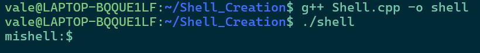
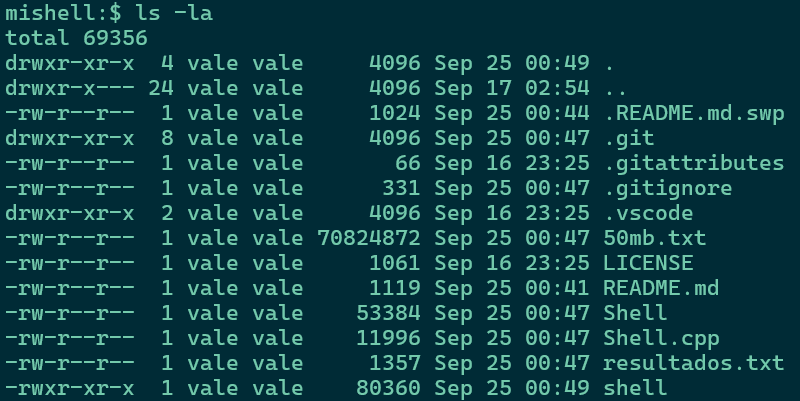
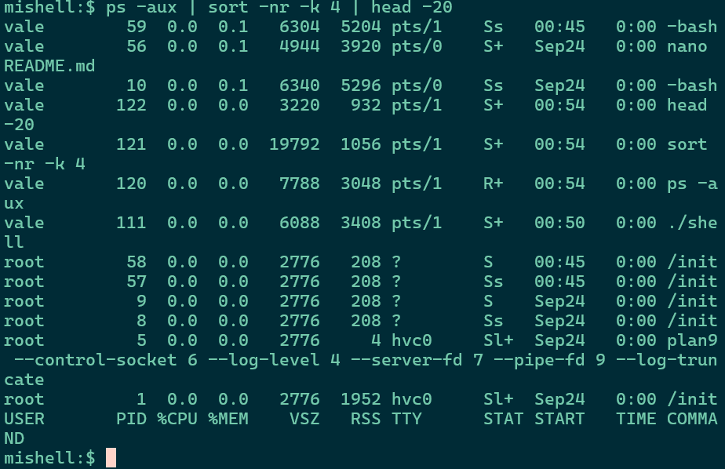
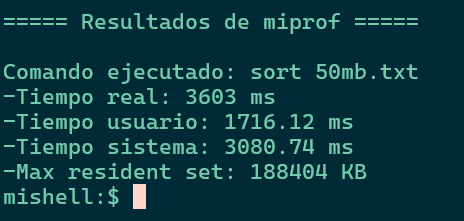
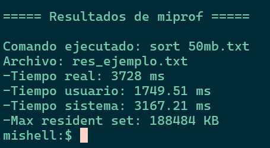
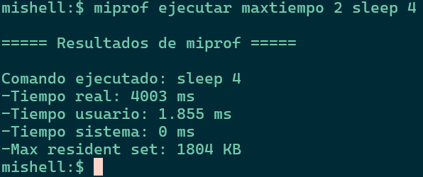

# Shell_Creation
Creación de una Shell en Linux requerido como la primera tarea del ramo Sistemas Operativos.

A continuación veremos una interfaz de shell comun y corriente que empieza con mishell$: 

## Compilación y ejecución
Para poder compilar se requiere de:
- Un compilador para C++ (g++)
- Sistema Linux/Unix
- Tener las bibliotecas estándar de C++ 

```bash
g++ Shell.cpp -o Shell  
./Shell
```


## Sintaxis para uso de mishell:$ 
```mishell:$ COMANDO (argumentos) | COMANDO (argumento) | ...```

## Sintaxis comando miprof 
```mishell:$ miprof OPCIÓN (argumentos) COMANDO (argumentos)```

Información que entrega:
  - Tiempo real: tiempo total de ejecución 
  - Tiempo de usuario: tiempo CPU en modo usuario 
  - Tiempo sistema: tiempo CPU en modo kernel 
  - Max Resident Set: memoria RAM máxima usada en KB 

## Ejemplo
### Comando sin y con pipes 

```mishell:$ ls -la```



```mishell:$ ps -aux | sort -nr -k 4 | head -20```



### Comandos de miprof
1. ejec: 
```mishell:$ miprof ejec sort archivo.txt```

2. ejecsave: 
```mishell:$ miprof ejecsave resultados.txt sort archivo.txt```

3. ejecución con máximo de tiempo: 
```mishell:$ miprof ejecutar maxtiempo 2 sleep 4```



